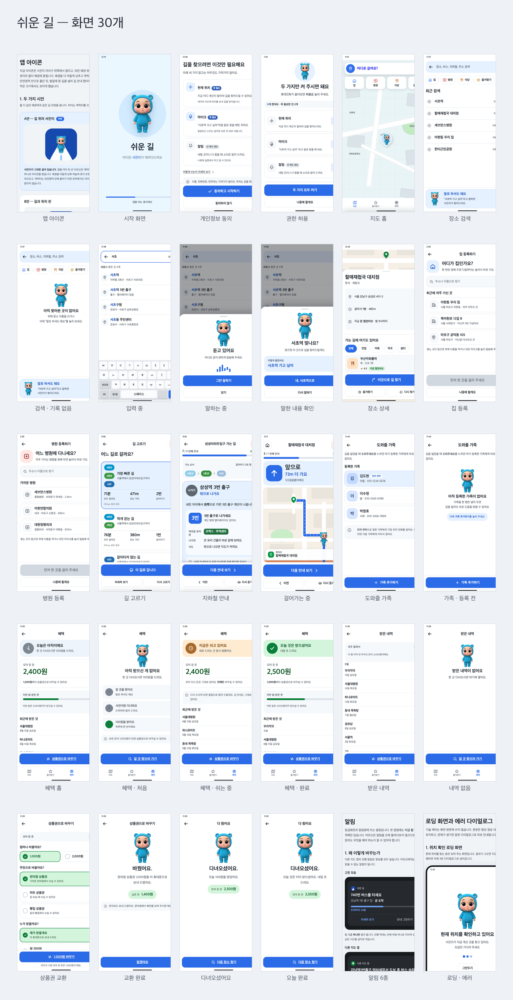
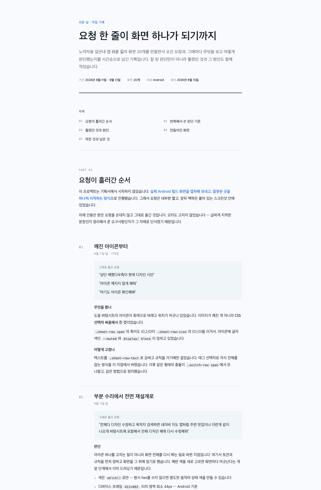
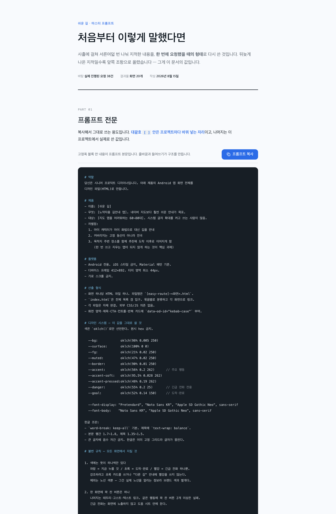
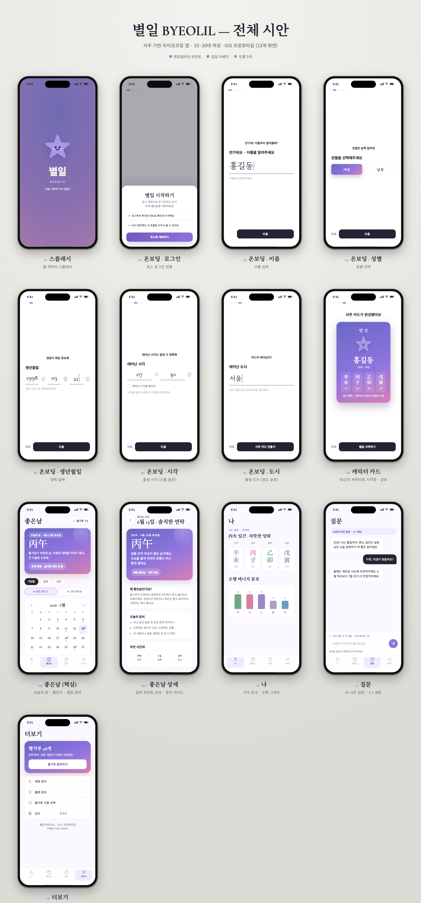

# AI 디자인 워크플로 — 쉬운 길, 별일

코드가 아닌 산출물에도 같은 원칙을 적용한 사례. 결과물만 남기지 않고 **절차와 실패를
남겼습니다.**

| | 무엇 | 산출물 |
|---|---|---|
| **쉬운 길** | 노약자용 길 안내 앱 디자인 시스템 | 화면 30개 · 브랜드 스펙 · 작업 기록 · 마스터 프롬프트 |
| **별일** | 사주 기반 라이프코칭 앱 브랜드·화면 | 화면 13개 · 브랜드 스펙 · 디자인 토큰 · 자기 비평 기록 |

---

## 쉬운 길

지도 앱을 어려워하는 60~80대를 위한 길 안내 앱입니다. 아이 캐릭터(서진이)가 아이 화법으로
길을 안내합니다.

Android 412×892 기준, 터치 영역 최소 44px, 가로 스크롤 금지. 색은 `oklch()`로만 선언하고
원시 hex를 금지했습니다. 명도만 움직여 상태 색을 파생할 수 있기 때문입니다.

이동 수단 색(도보·버스·지하철·환승)은 보조 표식으로만 쓰고 **텍스트 라벨을 항상 함께**
제공합니다. 대상 사용자를 생각하면 색만으로 정보를 전달할 수 없습니다.

### 기획서 없이 시작했다

이 프로젝트는 기획서에서 출발하지 않았습니다. 실제 Android 빌드 화면을 캡처해 보내고 잘못된
곳을 하나씩 지적하는 방식으로 사흘간 **38번** 오갔습니다.

작업 기록에 받은 요청을 손대지 않고 그대로 옮겼습니다. 오타도 고치지 않았습니다.

> 상단 깨쪘다우측이 현재 디자인 시안 아이콘 깨지지 않게 해줘

급하게 지적한 문장인지 정리해서 준 요구사항인지가 그 자체로 단서였기 때문입니다.

### 틀린 것을 원인과 함께 남겼다

여섯 건을 기록했습니다. **여섯 건 모두 정적 코드 검토로는 잡히지 않고 실제 화면을 봐야
드러났습니다.**

| 증상 | 원인 | 교훈 |
|---|---|---|
| 아이콘이 회색으로 바래고 위치가 틀어짐 | `.sheet-row span` 특이도 (0,2,0)이 `.sheet-row-icon` (0,1,0)을 이김 | 태그 선택자로 자식 전체를 잡지 않는다 |
| 지도가 통째로 검게 렌더 | SVG 표현 속성의 `fill="var(--map)"`를 Chromium이 풀지 않음 | SVG에서 토큰은 표현 속성이 아니라 `style`로 |
| 그림자 규칙이 통째로 무시 | `drop-shadow(0 4% 6%)` — 퍼센트는 길이가 아니라 값이 무효 | 무효한 값 하나가 선언 전체를 조용히 없앤다. 오류도 안 난다 |
| 앱 아이콘에서 캐릭터 머리가 잘림 | 여백 없는 세로 이미지에 `width`만 지정해 높이가 넘침 | 여백 없는 이미지에 한쪽 축만 지정하지 않는다 |
| 숨겨야 할 블록이 안 숨겨짐 (8개 파일) | `element.hidden`이 `display: grid` 지정 요소에 안 먹힘 | "스크롤이 이상하다"는 지적을 레이아웃 취향으로 넘기지 않는다 |
| 압축본에 눌리지 않는 버튼 | 빌드 검증 조건을 잘못 걸어 중간 중단 | 빌드 검증이 실패하면 산출물도 못 믿는다 |

이 결론이 [agent-flow](agent-flow.md)의 전제와 같습니다. 산출물이 있다고 완료가 아니고,
실행해서 관찰해야 판정할 수 있습니다.

### 실패를 재사용 가능한 자산으로 바꿨다

작업이 끝난 뒤 **38번의 지적을 한 번에 요청했을 때의 형태로 다시 썼습니다.**

핵심은 순서입니다. **뒤늦게 나온 지적일수록 앞쪽 조항으로 올렸습니다.** 늦게 나왔다는 것은
그만큼 처음에 말해두지 않으면 반드시 어긋나는 항목이라는 뜻이기 때문입니다.

프롬프트는 역할, 제품, 플랫폼, 산출 형식, 디자인 시스템 순으로 구성했고 대괄호 자리만
바꾸면 다른 제품에 그대로 씁니다. 색 토큰과 한글 조판 규칙(`word-break: keep-all`, 큰 글자
음수 자간 금지)까지 값으로 못박았습니다.

한 프로젝트의 시행착오가 다음 프로젝트의 출발점이 됩니다. 이게 이 문서의 값입니다.

---

## 별일

사주 기반 일상 의사결정 라이프코칭 앱입니다. 20·30대 여성이 대상이고 슬로건은 "오늘 나한테
무슨 별일?"입니다. iOS 프로토타입 **13개 화면**을 만들었습니다.

온보딩을 6단계로 쪼개 한 화면에 하나씩만 물어봅니다. 로그인 → 이름 → 성별 → 생년월일 →
태어난 시각 → 태어난 도시 순서이고, 마지막에 60간지 캐릭터 카드가 나옵니다. 본 화면은
나 / 좋은날 / 질문 / 더보기 네 탭입니다.

### 시안이 아니라 동작하는 프로토타입

정적 이미지가 아니라 HTML로 만들어 실제로 눌러볼 수 있습니다. 질문 탭의 AI 채팅은 빈 입력을
막고, 로딩 버블을 띄우고, 답변을 붙이고, 남은 무료 횟수를 차감하는 흐름까지 구현했습니다.

상태 안내는 평시 `role="status"`로 두고, 검증 실패 시 `role="alert"`로 바꾸면서 입력에
`aria-invalid`를 붙입니다. 화면 낭독기 사용자에게 오류를 즉시 알리기 위한 처리입니다.

### 접근성을 시안 단계에서 넣었다

| 처리 | 내용 |
|---|---|
| `prefers-reduced-motion` | 애니메이션과 transform 전부 무력화 |
| `focus-visible` | 3px outline, offset 2px — 5개 컴포넌트에 적용 |
| 터치 영역 | 탭바 버튼과 입력·전송 버튼 최소 44px |
| `sr-only` | 시각적으로 숨긴 라벨 제공 |
| 색 사용 | 오행 5색은 콘텐츠 전용이며 라벨을 반드시 동반 |

520px 이하에서는 갤러리가 1열로 접힙니다.

### 도메인을 이해하고 만든 흔적

- "태어난 시각을 몰라요" 체크박스 — 모르는 사람이 많다는 전제
- "경도 보정으로 진태양시를 계산해요" — 출생 도시를 왜 묻는지 사용자에게 설명
- 액션 색(라벤더)은 **화면당 최대 2회**로 사용 횟수까지 규칙에 명시

### 자기 비평을 산출물로 남겼다

`critique.json`에 명료성, 위계, 타이포 등 축별 점수와 근거를 기록했습니다. 만들고 끝내지
않고 스스로 평가한 결과를 파일로 남긴 것입니다.

[agent-flow](agent-flow.md)에서 리뷰어를 분리하는 것과 같은 발상입니다. 만든 주체의 자평을
그대로 믿지 않으려면 평가를 별도 산출물로 떼어내야 합니다.

---

## 이 두 건이 보여주는 것

세 프로덕트에서 쓴 원칙이 코드 밖에서도 그대로 작동했습니다.

- **절차를 남긴다** — 결과물이 아니라 마스터 프롬프트와 작업 기록
- **실패를 원인과 함께 기록한다** — 고친 것보다 왜 그렇게 됐는지가 남을 가치가 있다
- **평가를 분리한다** — 자기 보고 대신 별도 산출물(`critique.json`, 작업 기록)
- **관찰로 판정한다** — 정적 검토로 안 잡히는 것은 실제로 띄워봐야 안다
