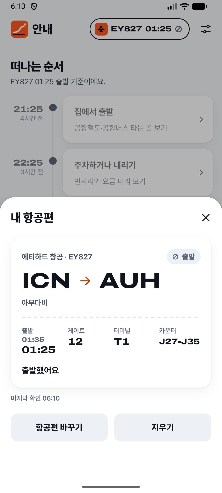

# app-qa

기획서와 QA 문서에서 테스트를 만들고, Android·iOS 앱과 웹사이트에서 실행해 판정하는 QA 자동화 도구.
확실하지 않은 결과는 PASS로 내보내지 않습니다.

**코드** [github.com/chonamdoo/app-qa](https://github.com/chonamdoo/app-qa)  
**규모** TypeScript 31,103줄 (src 19,171 + test 11,932) · Swift 3,552줄 · 테스트 586개 · 커밋 33  
**대상** Android 앱·Chrome, iOS 시뮬레이터 앱·Safari, 데스크톱 Chrome·Safari · macOS · Node 24

---

## 문제

UI 자동화 도구가 "성공"이라고 보고해도 화면에서 실제로 일이 일어났다는 뜻은 아닙니다. 설계 문서에 남긴
관찰 두 개가 출발점입니다.

> AXe 기본 탭은 RN에서 무반응인데 "성공" 보고 → 사후 확인 필수

> 가려진 "항공편 바꾸기"를 탭하자 최상단 시트 영역이 눌림 → occlusion 필터 필수

AXe는 iOS 시뮬레이터 조작 도구이고, RN은 React Native입니다. 첫째는 아무 반응이 없는데 도구가 성공을
보고한 경우이고, 둘째는 바텀시트 뒤에 가려진 버튼을 누르려다 시트를 누른 경우입니다.

모델도 마찬가지입니다. 초기 설계 리뷰에 "모델의 DONE은 증거 아님"이라고 적고, 원칙을 한 줄로 정했습니다.

> fail-closed(불확실 ≠ PASS), 결과 불확실한 행동 재시도 금지, 모델 자기 판정 금지, 도구는 프로젝트 로컬.

---

## 판정은 코드가 한다

| 맡은 쪽 | 하는 일 | 할 수 없는 일 |
|---|---|---|
| 코드 | 규칙, 권한, 실행, PASS/FAIL 판정 | |
| LLM (Claude·Codex CLI) | 문서를 읽고 테스트 초안 작성 | 도구 사용, 파일 쓰기, 비밀값 접근, 테스트 승인 |
| Jev (TypeSafe의 판단 모델) | 형식이 정해진 좁은 질문에 확률로 답함 | 혼자서 내리는 PASS 판정, 권한 부여 |
| 사람 | 위험 동작 승인, 초안(draft) 검토 | |

LLM은 `claude -p … --tools ""`나 `codex exec … -s read-only`로 부릅니다. 자식 프로세스에는 허용 목록에
있는 환경 변수만 넘기므로 `TYPESAFE_API_KEY`와 앱 비밀값이 들어가지 않습니다.

Jev가 답하는 질문은 다섯 종류입니다. 이 문구가 가리키는 화면 요소는 어느 것인가, 화면에 이런 내용이
있는가, 지금 어느 화면인가, 이 요소를 누르면 되돌릴 수 없거나 외부로 나가는 변경이 생기는가, 생성된
테스트가 요구사항을 다루는가. 코드는 Jev 답의 확률이 보정한 임계치를 넘을 때만 판정에 씁니다. 위험 판정은
한·영 키워드로 막는 결정적 정책 위에서 거절을 더할 수만 있고, 허용을 늘리지는 못합니다.

---

## 테스트는 사람이 읽는 문구로 쓴다

앱과 웹이 같은 형식을 씁니다. 셀렉터 대신 화면에 보이는 문구로 대상을 적습니다.

```yaml
id: web-demo-search
name: 상품을 검색하면 일치하는 상품만 남는다
app: web-demo
steps:
  - see: 검색
  - type: 사과
    into: 상품 검색
  - hideKeyboard: true
  - tap: 검색
    expect:
      text: 상품 1개
  - assertNoText: 바나나
```

삭제·결제·보내기처럼 위험해 보이는 동작은 막힙니다. 사람이 확인한 스텝만 `allowRisky: true`로 엽니다.
비밀값은 `${NAME}`으로 적고, 입력한 값은 기록에 남기지 않습니다.

---

## 한 스텝이 지나가는 길

```
관찰 → 대상 찾기 → 실행 전 확인 → 기록 → 실행 → 안정 대기 → 상태 점검 → 기대값 확인
```



이 화면에서 시트 뒤 타임라인은 보이지만 누를 수 없습니다. 가림을 계산할 때는 터치할 수 있는 요소만 다른
요소를 가린다고 보고, 대상의 가려지지 않은 가장 큰 영역 가운데를 누릅니다. 설계 문서에 이 화면의 정답을
적어 두었습니다. 누를 수 있는 요소는 `닫기`, `항공편 바꾸기`, `내 항공편 지우기` 셋이고 나머지 13개는
가려져 있습니다. 모든 요소를 가림 후보로 보면 누를 수 있는 요소가 0개가 되어 틀립니다.
`내 항공편 지우기`는 `지우기` 키워드 때문에 사람이 승인하기 전에는 누르지 않습니다.

나머지 단계의 규칙은 이렇습니다.

- **실행 직전에 다시 본다** — 동작 직전에 화면을 다시 관찰하고 대상이 실제로 눌리는 위치인지 확인합니다.
  Jev 답을 기다리는 사이 대상 요소의 위치나 상태가 바뀌었으면 `stale_target`으로 실패합니다. 시계처럼
  대상과 무관한 변화는 문제 삼지 않습니다.
- **결과를 모르는 동작은 다시 하지 않는다** — 동작을 보내기 전에 의도를 기록 파일에 fsync합니다. 전송
  오류나 타임아웃이면 결과를 `uncertain`으로 남기고 테스트를 ERROR로 끝냅니다. 자동 재시도는 없습니다.
- **변화가 없으면 성공이 아니다** — 동작 뒤 화면 구조가 바뀌고 안정될 때까지 기다립니다. 바뀌지 않으면
  INCONCLUSIVE(`no_effect`)입니다. 앞의 "무반응인데 성공 보고"를 막는 규칙입니다.
- **매 스텝 상태를 점검한다** — 다른 앱이 앞에 나옴, 크래시·ANR 대화상자, React Native 오류 화면, 빈
  화면, 웹 페이지 로드 오류와 허용하지 않은 주소로의 이동을 잡습니다.

판정 우선순위는 ERROR > FAIL > INCONCLUSIVE > PASS입니다. 한 스텝이라도 확실하지 않으면 테스트는 PASS가
되지 않습니다.

---

## 모델 답을 쓰기 전에 기준부터 고정했다

Jev 답은 확률이라 몇 이상이면 믿을지 정해야 합니다. 질문마다 정답이 있는 골든셋을 만들고, 첫 실호출
전에 합격 기준을 파일 머리말에 고정했습니다.

- 확신 오답 0건: 임계치를 넘었는데 틀린 답이 하나도 없어야 함
- 수용률 80% 이상: 임계치를 넘어 판정에 쓸 수 있는 답의 비율
- 위험 판정은 오경보율 10% 이하: 안전한 요소를 위험하다고 본 비율

`qa calibrate`는 0.01 간격으로 임계치를 찾되, 확신 오답이 가장 적은 값을 먼저 고르고 그다음 수용 건수가
많은 값을 고릅니다. 보정 기록이 없는 질문은 판정 자체가 `error(uncalibrated)`입니다.

| 질문 | 항목 | 수용 | 확신 오답 | 비고 |
|---|---|---|---|---|
| 대상 찾기 | 76 | 67 (88.2%) | 0 | |
| 화면 내용 확인 | 52 | 51 | 0 | |
| 화면 구분 | 17 | 15 | 0 | |
| 위험 판정, 앱 | 34 | 34 | 0 | 오경보 0/20, 임계치 0.47 |
| 위험 판정, 웹 탐색용 | 81 | 76 | 0 | 오경보 5/61, 임계치 0.20 |
| 위험 판정, 웹 홀드아웃 | 57 | 55 | 0 | 오경보 2/39, 임계치를 다시 고르지 않고 확인 |
| 생성 테스트 검토 | 30 | 29 | 0 | |

처음에는 앱과 웹에 임계치 하나를 쓰려 했습니다. 합친 임계치 0.20에서는 앱 쪽 오경보가 3/20(15%)으로
기준을 넘었고, 미리 정한 규칙(v3)대로라면 앱 쪽이 보정 대상에서 빠지는 결과였습니다. 이 시도는 탐색용으로
돌려 기록에 쓰지 않았고, 웹 홀드아웃을 처음 호출하기 전에 앱과 웹의 임계치를 따로 찾는 새 규칙(v4)을
고정했습니다. 합격 기준(확신 오답 0, 오경보 10% 이하)은 바꾸지 않았습니다. 실패한 시도는
`calibration/trials/commit-web-v3/`에 남겼습니다. 생성 테스트 검토에 넣으려던 질문 하나("기대값을 모두
확인하는가")는 참인 항목 16개 중 11개만 0.50을 넘어 채택하지 않았습니다.

녹화한 Jev 응답 349개로 보정을 다시 돌리면 기록된 임계치가 그대로 나오는지 테스트가 확인합니다.

이 수치로 말할 수 없는 것도 있습니다.

- 웹 위험 판정을 빼면 임계치를 찾은 항목과 결과를 보고한 항목이 같습니다. 따로 떼어 둔 확인용 항목이
  없습니다.
- 녹화된 화면에 대한 Jev 답의 정확도입니다. 실제 앱에서 테스트 전체가 맞게 판정하는 비율이 아닙니다.
- 앱 위험 판정 항목 34개 중 17개(위험 쪽은 14개 중 13개)는 실측 화면의 라벨만 바꾼 합성 변형입니다. 키워드
  정책이 이미 막는 대상을 빼면, 실측한 위험 대상은 Expo Go의 `CLEAR` 하나뿐입니다.
- 웹 화면은 직접 만든 가상 서비스 화면(탐색용 19개, 홀드아웃 15개)과 데모 상점 화면입니다. 가상 서비스
  화면은 headless Chrome에서 캡처했습니다.
- 질문별 항목이 17~81개로 적습니다.

---

## 문서에서 테스트까지

`qa plan`은 기획서와 QA 체크리스트(.md, .xlsx)를 읽어 요구사항마다 테스트 초안을 만듭니다.

1. LLM이 요구사항별 초안을 씁니다.
2. 코드가 결정적으로 검사합니다. 스키마, 모든 요구사항에 테스트나 "테스트 불가" 사유가 붙었는지,
   `allowRisky`·위험 라벨·제출 키가 없는지 봅니다.
3. 검사에 걸리면 한 번만 고쳐 쓰게 하고, 그래도 걸리는 테스트는 이유와 함께 버립니다.
4. Jev가 테스트가 요구사항을 다루는지 검토합니다.
5. `--approve`를 주고 검토를 통과한 테스트만 `approved`가 되고, 나머지는 `draft`로 남습니다.

`plan.json`이 요구사항, 테스트, 결과를 잇습니다. 저장소에 있는 떠남 앱 예시는 요구사항 30개에서 테스트
8개를 만들었고, 5개는 이유와 함께 테스트 불가로 표시했습니다. 8개 모두 draft입니다.

---

## 앱과 웹을 한 파이프라인으로

웹 대상을 붙일 때 실행기를 따로 만들지 않았습니다. 교차 리뷰 결과 문서에 이유를 적었습니다.

> 안전 불변식(기록 후 실행, `uncertain` 재시도 금지, commit 확인, 정제)을 실행기마다 다시 구현하면 어긋난다.

같은 이유로 Playwright도 쓰지 않았습니다. Playwright의 자동 대기와 재시도가 안정 대기 규칙, 재시도 금지
규칙과 충돌합니다. 데스크톱은 W3C 드라이버로 실제 마우스·키 입력만 보내고, JS 클릭이나 DOM 값 주입은
쓰지 않습니다.

실제 실행에서 찾아 고친 문제도 있습니다. 데스크톱 Chrome과 Safari를 동시에 돌리면 앞에 있는 창만 입력을
받아 Safari 클릭이 무시됐습니다. 그래서 데스크톱 브라우저는 한 번에 하나만 돌도록 한 실행 안, 작업 큐,
Mac 전체에 각각 잠금을 걸었습니다.

웹 실행 결과는 [web-qa 스킬](agent-skills.md#web-qa)의 검사 스크립트(`check-run.mjs`)가 읽는 형식으로도
내보냅니다.

---

## 설계 계약을 테스트로 묶었다

`skills/architecture/SKILL.md`는 이 저장소를 고치는 코딩 에이전트가 읽는 설계 계약입니다. 모듈 의존 방향,
불변식, 피해야 할 것 목록, 리뷰 체크리스트가 들어 있습니다. 그중 모듈 의존 표는
`test/architecture/imports.test.ts`가 `src/`와 `bin/`의 모든 import에 대해 검사합니다. 계약을 어기면
테스트가 깨집니다.

커밋 33개 중 12개가 리뷰 지적 수정(`fix: close … review findings`)입니다. 웹 구조와 문서 입력 방식은
Claude Opus 5.5와 GPT-6 sol이 각각 검토한 결과를 비교해 정했고, 그 기록이 `docs/reviews/`에 있습니다.

---

## 검증 상태

- 테스트 586개(node:test, 58개 파일)는 실기기 없이 돕니다. 가짜 드라이버, 녹화된 화면 fixture, Appium
  HTTP 스텁, 녹화된 Jev 응답을 씁니다.
- CI는 없습니다.
- 실행 결과물(`.qa/`)은 저장소에 올리지 않습니다. 저장소의 생성 테스트는 모두 draft이고, 실행해 통과한
  기록은 저장소에 없습니다.

---

## 한계

- iOS는 시뮬레이터만 지원합니다. 실기기 iPhone Safari와 Internet Explorer는 지원하지 않습니다.
- 웹 뷰포트는 프로필당 하나입니다.
- 아이콘만 있는 화면, canvas, 게임 화면은 INCONCLUSIVE(`unsupported_surface`)로 남깁니다. 화면 이미지를
  보고 판단하는 비전 LLM은 v1에서 쓰지 않기로 했습니다.
- 웹 위험 판정(임계치 0.20)은 `로그인`을 외부 변경으로 보는 오경보가 있습니다. 필요한 테스트에서 사람이
  `allowRisky`로 승인합니다.
- 문서 입력 개선안(스프레드시트 정리, 원문 인용 검사, 스크린샷 입력)은 리뷰 문서에 계획만 있고 아직
  구현하지 않았습니다.

---

## 수치 기준

2026-10-05, main(`86d5685`) 기준입니다. TypeScript 줄 수는 `src/`와 `test/`의 `.ts` 파일, Swift 줄 수는
추적되는 `.swift` 파일 전체를 `git ls-files`로 골라 `wc -l`로 셌습니다. 녹화된 Jev 응답 349개, 화면
fixture, 예제 사이트, 보정 데이터(JSON·XML·YAML)는 뺐습니다. 테스트 수는 테스트 파일의 `it(`/`test(` 호출
수입니다.
