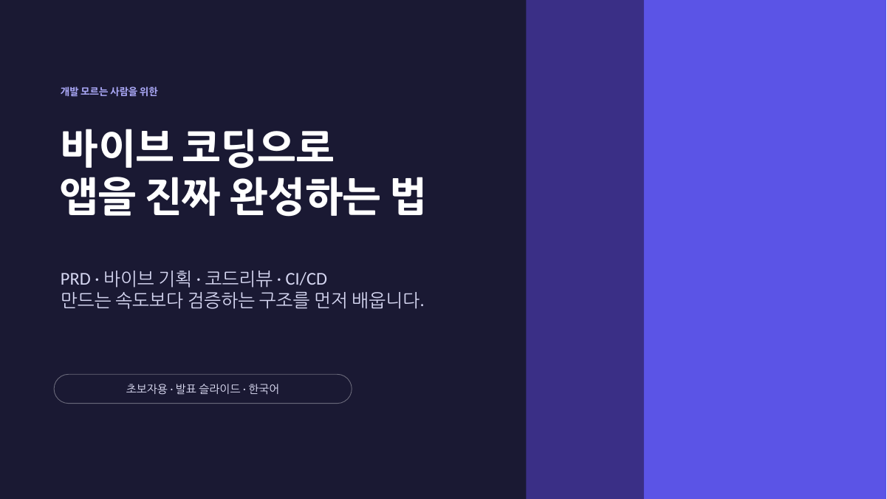
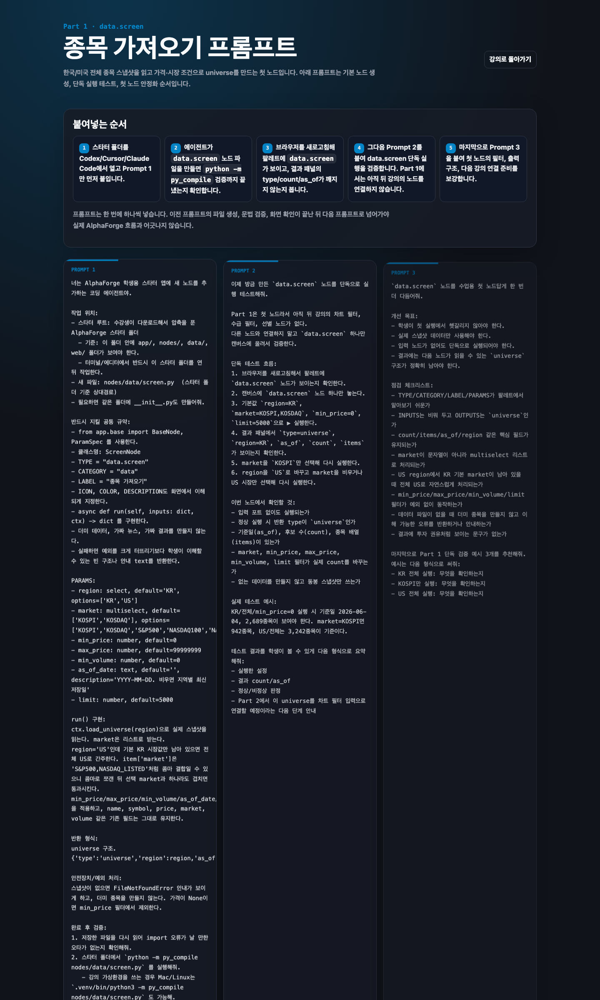

# AI 개발 교육 — 강의 자료 제작

[agent-flow](agent-flow.md)로 혼자 쓰던 원칙을, 개발을 모르는 사람이 따라 할 수 있는
형태로 다시 쓴 작업입니다.

| 자료 | 형태 | 분량 |
|---|---|---|
| 바이브 코딩으로 앱을 진짜 완성하는 법 | 발표 슬라이드 | 37장 |
| AlphaForge 실습 커리큘럼 | 스타터 앱 + 파트별 프롬프트 정본 | 12개 파트 · 앱 36파일 |
| [쉬운 길 마스터 프롬프트](ai-design-workflow.md) | 재사용 프롬프트 | 요청 38건을 1건으로 |

---

## 왜 이걸 만들었나

혼자 쓰는 절차를 만드는 것과, 남이 쓸 수 있게 만드는 것은 다른 일입니다.

`agent-flow`의 게이트는 제게 맞춰 설계돼 있습니다. `required_markers`가 무슨 뜻인지 알고,
왜 red 단계에서 테스트가 실패해야 하는지 아는 사람에게만 작동합니다. 그 전제를 걷어내고
같은 원리를 전달하려면 어휘부터 바꿔야 했습니다.

---

## 바이브 코딩으로 앱을 진짜 완성하는 법



부제는 **"만드는 속도보다 검증하는 구조를 먼저 배웁니다"**입니다. 대상은 앱 아이디어는
있지만 개발자가 아닌 사람입니다.

> 오늘 목표는 개발자가 되는 것이 아닙니다. AI에게 앱 제작을 맡길 수 있을 만큼 **정확한
> 의뢰자**가 되는 것입니다.

### 문제 정의

> AI는 코드를 빨리 만듭니다. 하지만 무엇이 맞는 코드인지는 기획서와 검증 루프가 정합니다.
>
> 바이브 코딩의 실력은 프롬프트 문장력이 아니라 PRD, 리뷰, CI/CD를 연결하는 능력입니다.

"10분 만에 만들고, 3시간 넘게 검수합니다"로 현실을 먼저 보여주고, 진짜 문제가 AI 성능이
아님을 짚습니다. 예시가 구체적입니다.

| 기획서 | 코드 | 결과 |
|---|---|---|
| 할인 코드는 결제 대행사와 연동되어야 한다 | DB에 할인 코드만 저장했다 | 사용자가 입력해도 할인이 적용되지 않는다 |

화면만 보면 동작하는 것처럼 보입니다. 코드만 봐도 잡기 어렵습니다. **기획서와 코드의
대조**가 필요하다는 결론으로 이어집니다.

### 전달한 도구 넷

**PRD 계층** — Requirement → Feature → Spec → Userflow. "쉽게 로그인하는 예쁜 가계부 앱"이
왜 나쁜 지시인지를 `R1 / F1 / S1 / U1` 형태와 나란히 놓고 보여줍니다. 좋은 PRD는 완료
기준이 있어서 리뷰 기준으로 쓸 수 있습니다.

**작업 단위** — "화면 하나. 기능 하나. 검증 하나." 순서는 PRD 읽기 → 목표 고르기 → 구현
→ Spec 대조 → 커밋입니다. 프롬프트도 범위를 못박습니다.

> PRD의 F1 기능만 구현해줘. 다른 기능은 만들지 말고, 어떤 Spec이 충족됐는지 알려줘.

**GAP 리포트** — Spec별로 구현됨 / 일부 구현 / 미구현과 위험도, 다음 액션을 표로 만듭니다.
*"GAP 리포트는 초보자의 눈을 대신합니다."*

**심각도와 게이트** — critical / major / minor / nit 네 단계를 정하고, 각 단계에서 자동화가
무엇을 하는지 계약으로 연결합니다.

| 결과 | 자동화 |
|---|---|
| critical 또는 major 있음 | 자동 승인 금지, 사람 리뷰 필수 |
| minor만 있음 | 승인 가능, 머지는 보류 |
| nit만 있음 | 팀이 허용하면 자동 머지 가능 |

> 심각도는 감정이 아니라 자동화의 계약입니다. 어느 단계부터 사람이 멈출지 정합니다.

이 문장이 강의 전체의 요지입니다. 리뷰 결과를 사람의 판단에 맡기지 않고 자동화 규칙으로
바꾸는 것이 `agent-flow`가 하는 일과 같습니다.

---

## AlphaForge 실습 커리큘럼

개념만 듣고는 못 만듭니다. 그래서 손으로 만드는 커리큘럼을 따로 짰습니다.

노드 기반 퀀트 스크리닝 앱을 12개 파트에 걸쳐 완성합니다.

```
Part 0   실습 준비 체크리스트
Part 1   종목 가져오기 (data.screen)      Part 6   AI 코멘트
Part 2   차트로 거르기                    Part 7   텔레그램 알림
Part 3   큰손 추적 (수급)                 Part 8   자동 스케줄
Part 3.5 수급 데이터 갱신                  Part 9   결과 저장
Part 4   선별 로직                        Part 10  리스크 비중
Part 5   백테스트
```



### 스타터 앱을 직접 만들어 배포했다

수강생이 빈 폴더에서 시작하면 환경 문제로 절반이 이탈합니다. 그래서 FastAPI 서버, 노드
베이스 클래스, 웹 팔레트 UI, 한국·미국 종목 데이터, Mac과 Windows용 실행·갱신 스크립트를
묶은 스타터를 제작했습니다. 36개 파일입니다.

`Part 0`은 코드가 아니라 체크리스트입니다. 폴더 구조가 보이는지, 데이터 파일이 있는지,
서버가 열리는지, 경로를 상대경로로 이해했는지를 먼저 확인시킵니다.

### 검증을 수강생이 아니라 프롬프트에 넣었다

> `python -m py_compile nodes/...`는 수강생이 직접 외워서 치는 것이 아니라, 프롬프트에 넣어
> AI 에이전트가 스타터 폴더에서 실행하게 합니다.

초보자에게 검증 명령을 외우게 하면 안 합니다. 그래서 검증을 프롬프트 안으로 옮겼습니다.
사람의 규율이 아니라 절차의 기본값으로 만든 것입니다.

### 프롬프트에 환각 방지 규약을 박았다

각 파트 프롬프트에 공통 규약이 들어 있습니다.

```
- from app.base import BaseNode, ParamSpec 를 사용한다.
- 클래스명: ScreenNode / TYPE = "data.screen"
- 더미 데이터, 가짜 뉴스, 가짜 결과를 만들지 않는다.
- 실패하면 (실패로 처리한다)
```

**"더미 데이터, 가짜 결과를 만들지 않는다"** — 초보자는 화면에 뭔가 나오면 됐다고 판단합니다.
그 지점을 프롬프트에서 먼저 막았습니다.

### 진행 순서를 강제했다

> 프롬프트는 한 번에 하나씩 넣습니다. 이전 프롬프트의 파일 생성, 문법 검증, 화면 확인이
> 끝난 뒤 다음 프롬프트로 넘어가야 실제 흐름과 어긋나지 않습니다.

`agent-flow`의 런너가 `next_command`로 하는 일을, 여기서는 문서의 순서와 확인 항목으로
했습니다. 도구를 깔게 할 수 없는 대상이라 절차를 문서에 담았습니다.

---

## 여기서 배운 것

`agent-flow`의 한계로 적어둔 항목 중 하나가 "팀원마다 다른 숙련도"입니다. 교육에서 그
문제를 먼저 만났습니다.

- **어휘를 바꿔야 한다** — `required_markers`는 안 통하고 "완료 기준"은 통합니다. 개념이
  어려운 게 아니라 이름이 장벽입니다
- **규율을 요구하면 실패한다** — 검증 명령을 외우게 하는 대신 프롬프트에 넣어야 실행됩니다.
  같은 이유로 `agent-flow`도 훅으로 관찰합니다
- **막히는 지점은 대개 환경이다** — 개념 설명보다 `Part 0` 체크리스트가 이탈을 더 줄입니다
- **판정 기준을 먼저 합의해야 한다** — 심각도 4단계를 정하지 않으면 리뷰 결과로 아무것도
  못 합니다. 조직에서도 같을 것입니다

다만 이건 **일방향 전달**입니다. 강의는 제가 정한 기준을 전하는 자리였고, 서로 다른 기준을
가진 사람들이 하나로 합의하는 과정은 아니었습니다. `agent-flow`에 남은 문제가 그것입니다.
