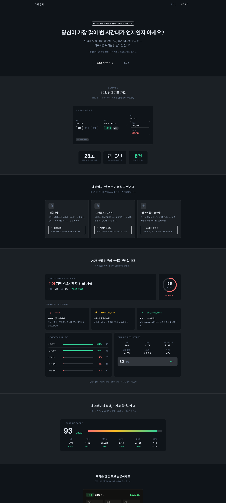
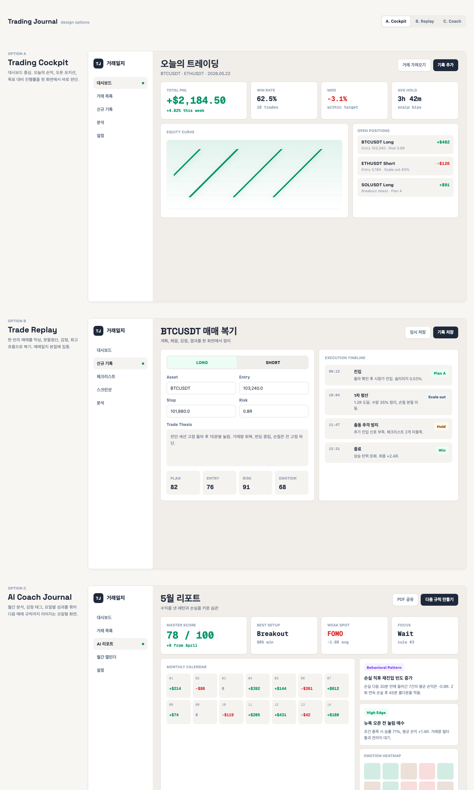

# trading-journal

크립토 선물 거래일지 웹 서비스.

**코드** [github.com/chonamdoo/trading-journal](https://github.com/chonamdoo/trading-journal)
**규모** TypeScript 30,655줄 (src+tests) · 커밋 156 · SPEC 문서 28건
**구성** API 라우트 50개 · 페이지 13개 · 기능 모듈 6개 · 마이그레이션 26건
**운영** [mytradelog.app](https://mytradelog.app) 실사용자 운영 중 · Next.js App Router + Supabase

---

## 기록 도구가 아니라 행동 교정 도구

선물 거래로 돈을 잃는 이유는 대개 분석이 틀려서가 아닙니다. 손절가를 안 걸고,
잃은 돈을 되찾으려 바로 재진입하고, 오른 걸 보고 뒤늦게 따라 들어갑니다. 거래가 끝난
뒤에 기록해 봐야 이미 늦습니다.

그래서 이 서비스는 두 지점에 개입합니다.

- **진입 직전** — 체크리스트와 시장 상태 경고로 실행을 한 번 멈춰 세웁니다
- **거래 후** — 행동을 태그로 남기고, 태그별 승률을 계산해 어떤 습관이 돈을 잃게 하는지
  숫자로 보여줍니다

---

## 화면

| 화면 | 내용 |
|---|---|
| `/` | 대시보드 — KPI 9종, 자산 추이 (거래 손익과 입출금을 분리한 2선 차트) |
| `/trades/new` | 거래 입력 — 복기 질문, 행동 태그, 체크리스트, 시장 요약 사이드바 |
| `/trades` | 거래 목록과 필터, 상단 KPI (월 손익·MDD·평균 보유시간·승률) |
| `/analysis` | 에쿼티 / Trading Score / 요일별 / 월간 캘린더 / 종목별 / 복기 태그별 |
| `/analysis/report` | 월간·주간 리포트 — 행동 패턴, 시간 히트맵, 감정별 승률, 레이더 차트 |
| `/settings` | 거래소 연동 5종, 초기 자산, 목표, 입금, 체크리스트 항목 편집 |

대시보드는 **거래 손익과 입출금을 분리해서** 보여줍니다. 총자산만 보면 입금해서 늘어난
건지 벌어서 늘어난 건지 구분이 안 됩니다. 자산 추이 차트에 두 선을 따로 그린 이유입니다.

---



---

## 화면을 정하기 전에 세 안을 만들어 비교했다

구현에 들어가기 전 성격이 다른 세 방향을 각각 화면으로 만들어 놓고 골랐습니다.



- **A. Trading Cockpit** — 대시보드 중심. 오늘의 손익과 오픈 포지션을 첫 화면에서 판단
- **B. Trade Replay** — 한 번의 매매를 계획·체결·감정·회고 흐름으로 복기
- **C. AI Coach Journal** — 월간 분석과 태그별 성과를 다음 매매 규칙까지 연결

셋 다 만들고 나서야 이 제품이 무엇인지 정해졌습니다. 최종 화면은 A의 대시보드에 B의 복기
질문과 C의 태그별 승률을 합친 형태입니다. 말로 고르면 셋의 차이가 잘 안 드러납니다.

거래 입력 화면도 같은 방식으로 여러 안을 만들어 비교했습니다
(`public/prototypes/trade-form-context-options-ui.html`).

---

## 진입 직전에 개입하는 장치

### 프리트레이드 체크리스트

`src/components/trades/preTradeChecklist.ts`

거래를 저장하기 전에 확인을 요구합니다. 기본 항목은 셋입니다.

```
손절가(SL)를 설정했는가?
총 자산의 2% 이내의 리스크인가?
추격 매수가 아닌가?
```

항목은 설정에서 바꿀 수 있습니다. `resolvePreTradeChecklistItems`가 사용자 정의 목록을
받고, 비어 있으면 기본값으로 돌아갑니다. 자기 약점에 맞춰 질문을 다시 쓰라는 뜻입니다.

체크를 안 해도 저장은 됩니다. 대신 `getPreTradeChecklistWarning`이 미확인 항목을 모아
경고를 띄웁니다. 막지 않고 보여주는 쪽을 골랐습니다. 강제하면 사람은 그냥 다 체크합니다.

### 리스크 모드

`src/components/trades/TradeSidePanel.tsx:564`

거래 입력 화면 옆에 시장 상태를 띄우고, 공포·탐욕 지수를 5구간(극단적 공포 / 공포 /
중립 / 탐욕 / 극단적 탐욕)으로 나눠 판정합니다. 공포 구간이면 이렇게 뜹니다.

```
리스크 모드
공포 구간. 진입 근거와 손절 기준 확인
```

같이 보여주는 지표는 BTC 가격과 점유율, 공포·탐욕 지수, 자산별 펀딩비와 롱숏 비율,
미결제약정입니다. 다른 탭을 열어 확인하던 것을 입력 화면 안으로 가져왔습니다.

시장 데이터는 외부 API에 의존하므로 실패를 전제로 만들었습니다. 인메모리 캐시에 TTL을
두고, 응답 신선도에 따라 `Cache-Control`을 동적으로 계산합니다. 외부 호출이 실패하면
만료된 캐시라도 반환합니다. 시장 데이터가 없다고 거래 입력을 막을 이유는 없습니다.

### 복기 질문

거래를 입력할 때 "이 거래는 어떤 매매였나요?"를 먼저 묻습니다. 선택지는 계획된 진입,
지지/저항 근거, 돌파/추세 근거, 충동 진입, 손실 복구 시도, 아직 모름입니다.

하나를 고르면 태그와 메모 초안이 자동으로 채워집니다. 계획된 진입을 고르면
`plan_followed`, `clear_reason` 태그가 붙고 메모에 초안이 들어갑니다.

빈 입력창을 주면 사람은 아무것도 안 씁니다. 초안을 채워 두고 고치게 하는 편이 기록이
남습니다.

---

## 태그 18개와 승률 계산

`src/lib/constants.ts`

행동을 세 그룹으로 나눠 태그를 붙입니다.

| 그룹 | 태그 |
|---|---|
| `good` (3) | 계획준수, 근거명확, 좋은대기 |
| `risk` (9) | 근거부족, 뇌동매매, FOMO, 복수매매, 재진입과다, 손절지연, 익절빠름, 익절지연, 사이즈과다 |
| `setup` (6) | 돌파, 지지반등, 눌림목, 추세추종, 역추세, 뉴스/이슈 |

리포트에서 태그별 승률을 계산합니다. "FOMO 태그가 붙은 거래의 승률"이 숫자로 나오면
그 습관을 고칠 근거가 생깁니다. 감정과 시간대도 같은 방식으로 쪼갭니다.

---

## 아키텍처

Feature module과 Clean Architecture를 결합했습니다 (ADR-0001).

```
src/features/
├── assets/           자산
├── capital-targets/  자본·목표
├── exchange-import/  거래소 동기화
├── reports/          리포트
├── trades/           거래
└── user-profile/     프로필·인증 경계
```

모듈마다 `domain`과 `data` 경계를 갖고, API 라우트는 어댑터 역할만 합니다.

이 구조는 처음부터 있지 않았습니다. 8개 슬라이스로 나눠 점진적으로 옮겼고 기록이
`.agent-flow/handoffs/`에 남아 있습니다.

```
slice-1 safety-foundation      slice-5 reports-feature-module
slice-2 trades-tracer          slice-6 user-profile-auth-boundary
slice-3 trades-route-adapter   slice-7 assets-capital-targets
slice-4 trades-lifecycle       slice-8 exchange-import-boundary
```

한 번에 갈아엎지 않고 슬라이스마다 테스트가 통과하는 상태를 유지했습니다.
[agent-flow](agent-flow.md)의 `slice-plan` 단계가 이걸 강제합니다.

---

## 남의 거래소 키를 맡는다는 것

거래소 5종(Binance, Bybit, OKX, Bitget, Flipster)의 API 키를 받아 거래 내역을
동기화합니다. 남의 자산에 접근할 수 있는 키를 대신 보관하는 일이라 여기를 가장
조심했습니다.

**키 암호화** — `AES-256-GCM`으로 암호화해 저장합니다 (`src/lib/exchange/crypto.ts`).
키 ID(`kid`)를 함께 기록해 키 링 회전을 지원합니다. 암호화 키를 교체해도 과거 데이터를
이전 키로 복호화할 수 있습니다.

**RLS 전면 적용** — 15개 테이블 전부 Row Level Security를 켰고 정책은 49개입니다.
미적용 테이블은 없습니다. 서버 코드에서 `service_role`을 쓰지 않고 anon key와 RLS 경로만
사용해, 애플리케이션 버그가 나도 DB가 최종 방어선으로 남게 했습니다.

**CI 게이트** (`web-guard.yml`)

```
tsc --noEmit            타입 검사
npm run lint            린트
Supabase Migration      마이그레이션 정합성
Secret Scan             시크릿 스캔
```

---

## AI 개발 흔적을 남겨둔 이유

이 저장소는 `.agent-flow/` 디렉터리를 커밋에 포함합니다. 지웠다면 더 깔끔했겠지만
절차가 실제로 돌았다는 증거라서 남겼습니다.

- `handoffs/` — 슬라이스별 인계 문서. 설계 판단과 남은 일이 적혀 있습니다
- `prompts/` — 단계별 프롬프트 정본 (`red`, `green`, `gates`, `fix-loop`, `ddd-design`)

커밋 로그에도 보입니다. `[autofix] Address review feedback` 같은 커밋은 리뷰
서브에이전트가 `request-changes`를 내고 `fix-loop` 단계로 되돌아간 흔적입니다.
브랜치 이름도 `codex/spec-002-auth-boundary`처럼 SPEC 번호를 달고 있습니다.

---

## 모바일 앱

같은 백엔드를 쓰는 React Native + Expo 앱을 따로 만들었습니다. 탭 5개 구성이고 API 모듈을
인증·프로필·거래·리포트 넷으로 나눴습니다.

- 이메일 로그인·가입·비밀번호 재설정, Google 로그인
- 거래 입력 — 금액과 수량 양방향 환산, 손절가와 예상 손익 미리보기, 스크린샷 첨부
- 분할 청산과 추가 진입 시 가중평균 진입가 자동 산출
- 서버 검색, CSV 내보내기, 지표 10종, 월간 캘린더, AI 리포트

401 응답이 오면 토큰 갱신을 요청당 1회로 묶어 재시도합니다. 화면 여러 개가 동시에 401을
받아도 갱신 요청이 중복되지 않습니다.

---

## 남은 것

- ADR이 1건뿐입니다. aitrading은 17건인데 이쪽은 설계 결정을 문서로 남기는 습관이 늦게
  붙었습니다
- 체크리스트를 건너뛰어도 저장됩니다. 경고만 띄우는 선택이 옳았는지는 아직 데이터가
  부족해 판단하지 못했습니다
- 문서와 코드가 어긋난 적이 있습니다. `docs/features-and-design-system.md`는 4월 26일
  기준이라 이후 SPEC으로 구현한 화면이 "미구현"으로 남아 있었습니다. `agent-flow`가
  README 숫자를 검사하는 이유가 이것입니다
